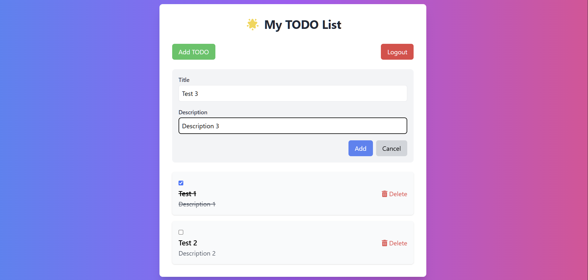
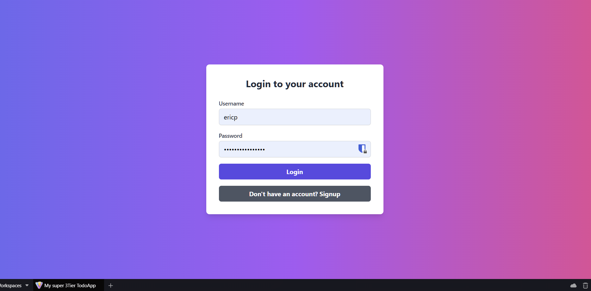
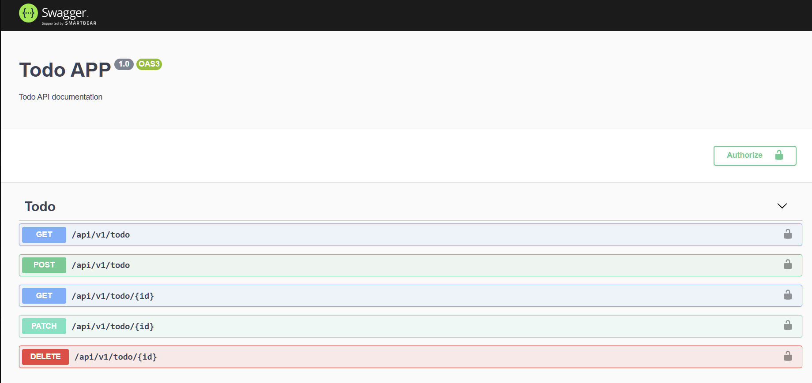

# ToDoApp


## Description

A simple TODO application under Docker environment with NestJS and Svelte. This project was made as a school project in order to have the best practices of a fullstack application. This project does not aim to be a complete application but rather a foundation to apply the best practices of a fullstack application.

## Table of Contents

- [ToDoApp](#todoapp)
  - [Description](#description)
  - [Table of Contents](#table-of-contents)
    - [🖼️ Illustration](#️-illustration)
  - [💽 Technologies](#-technologies)
  - [🐳 Running the app on docker](#-running-the-app-on-docker)
    - [🐋 Docker build \& start](#-docker-build--start)
    - [💾 Migration](#-migration)
  - [🖲️ Running the app without docker](#️-running-the-app-without-docker)
    - [⏏️ Installation](#️-installation)
    - [💾 Migration (without docker)](#-migration-without-docker)
  - [🎬 Running the app](#-running-the-app)
  
> Check the [CHANGELOG](./CHANGELOG.md) for the latest changes.

### 🖼️ Illustration





## 💽 Technologies

* NestJS
* TypeORM
* Svelte
* PostgreSQL
* PGadmin4
* JWT
* Docker
* Swagger



## 🐳 Running the app on docker

### 🐋 Docker build & start

```bash
# docker env build
$ docker-compose build

# docker env start
$ docker-compose up

# remove docker container (services & networks)
$ docker-compose down
```

### 💾 Migration

```bash
# generate migration
$ docker-compose run nestjs npm run typeorm:generate AnyNameYouLike

# run migration
$ docker-compose run nestjs npm run typeorm:run
```

## 🖲️ Running the app without docker

### ⏏️ Installation

```bash
$ npm install
```

### 💾 Migration (without docker)

```bash
# generate migration
$ npm run typeorm:generate AnyNameYouLike

# run migration
$ npm run typeorm:run
```

## 🎬 Running the app

```bash
# development
$ npm run start

# watch mode
$ npm run start:dev

# production mode
$ npm run start:prod
```
